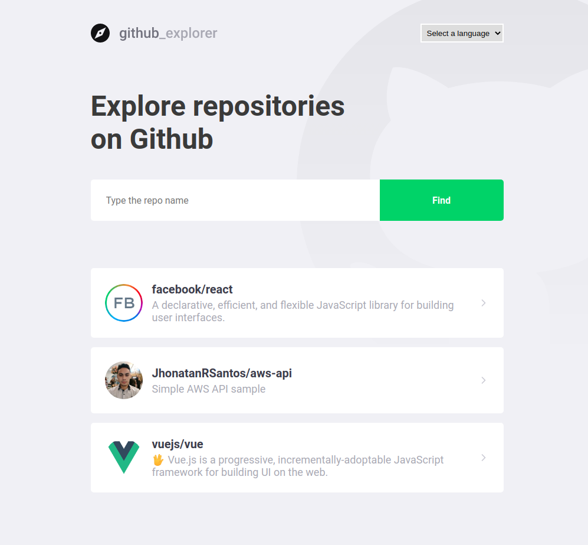
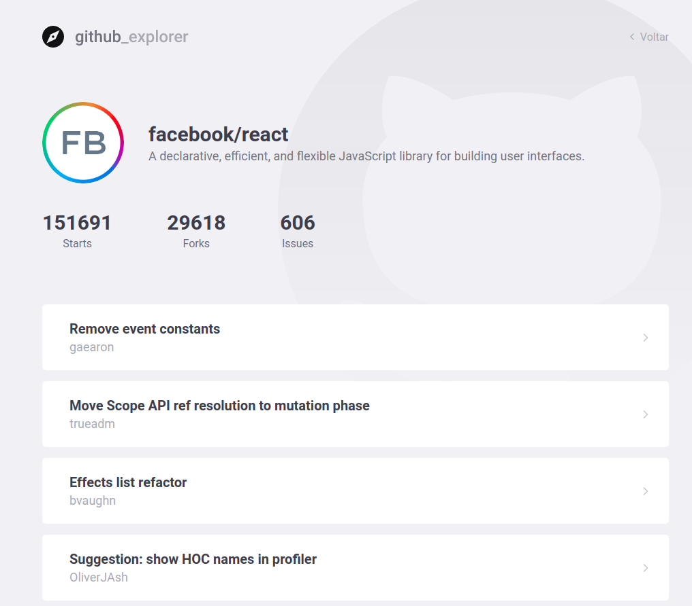

# This repository was made during the Rocketseat GoStack Bootcamp 12!

## Running the project
1 - Clone or download the <a href="https://github.com/JhonatanRSantos/github-explorer.git">repository</a>.

2 - Install all dependencies.

3 - Run:

```bash
yarn start
```

# Pages



<strong>To find a repository type the username/repo_name</strong>



<strong>Repository information</strong>


By me :)
